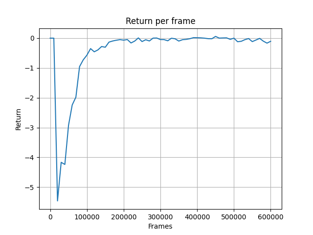

# RL SANDBOX

This project contains implementations of a number of well-known reinforcement learning algorithms.
The project implements

- DQN
- REINFORCE
- Actor-Critic
- Actor-Critic with PPO

They have been implemented to run on the [Gymnasium](https://gymnasium.farama.org/) environments "Cartpole-v1" and "LunarLander-v2".
The agents that uses policy gradient (all but DQN) can run "LunarLander-v2" as a continous environment.
DQN, Actor-Critic and PPO can be trained using vectorized environments.

## Installation

To install the project, you need to clone the repository and install the requirements.

```bash
git clone
cd RL_sandbox
pip install -r requirements.txt
```

If you cannot install `gymnasium[box2d]` you might be missing [Swig](http://www.swig.org/download.html). It can be downloaded from the link. Rembember to add it to the system path.

## Usage
To train an agent run:

```bash
python src/run.py -agent=AGENT
```

The replicate the experiments generating the results in the results section, go to the corresponding subfolder in `/outputs` and pass the args provided in `args_overwrites.txt` to `src/run.py` using the CLI. 

To see how a trained agents plays run:

```bash
python src/run.py -eval=1 -eval_path=PATH_TO_EXPERIMENT
```

The experiments made in this project can be found in the `/outputs` folder.
Example of PATH_TO_EXPERIMENT could be outputs/deepq/deepq_num_envs=10.

For more details on all arguments that can be passed to `run.py` see `argparser.py`. 

## File structure

**<ins>/outputs</ins>**

The outputs of the experiments. Each type of agent has its own subfolder. The ouput of a new experiments is saved under the corresponding agent folder.

The experiment subfolders consist of: 
- diagnostics plots
- the trained policy (the policy used for the last step of training) 
- the args parsed to run.py
- the args parsed via CLI (non-default args)

**<ins>/src</ins>**

The source code of the project.

- **run.py:** main entrypoint from which all experiments are run.  
- **agents.py:** all the implemented  reinforcements learning agents.
- **policy_networks.py**: all the policy networks used by the agents to take actions.
- **critic_networks.py**: the critic networks used by the Actor-Critic agent.
- **backbones.py**: the NN architecture used by the policy networks to output actions from states.
- **buffers.py**: the batchloader used by all agents to retrieve training data.
- **builders.py**: builds the agent environment from args.
- **argsparser.py**: all arguments that can be passed to the run.py.
- **train.py** training script for agents.
- **eval.py** used to render episodes for trained agents.
- **utils:** consists of adhoc functions used by other scripts.

## Results


Only results for the "LunarLander-v2" are shown.

\****RETURN is the same as REWARD IN THE PLOTS BELOW***

### Discrete

DQN


REINFORCE


Actor-Critic


Actor-Critic with PPO


### Continous

REINFORCE



Actor-Critic


Actor-Critic with PPO


### Discrete 10 environments

\****Mind that the x-axis is in iterations. For each iteration the agent recieves 10 frames, one for each environment running in parallel.***

DQN


Actor-Critic


Actor-Critic with PPO


### Continous 10 environments

\****Mind that the x-axis is in iterations. For each iteration the agent recieves 10 frames, one for each environment running in parallel.***

Actor-Critic


Actor-Critic with PPO

